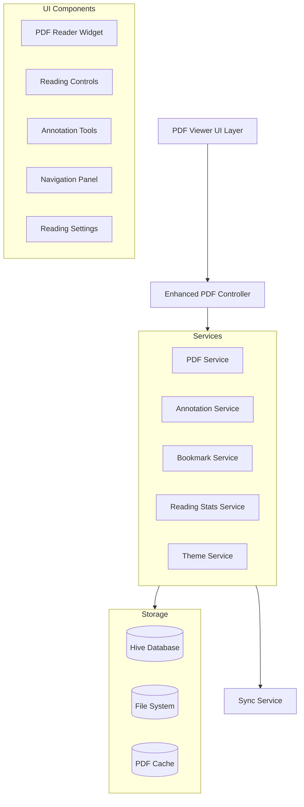

# Design Document

## Overview

This design document outlines the architecture and implementation approach for enhancing the PDF viewer in the Flutter book reading app. The enhancement transforms the current basic PDF viewer into a modern, feature-rich reading experience with advanced capabilities like annotations, bookmarks, reading statistics, and improved UI/UX.

The design follows the existing app architecture using GetX for state management, maintains consistency with the current Material 3 theme system, and introduces new modular components for enhanced functionality while preserving backward compatibility.

## Architecture

### High-Level Architecture



### State Management Architecture

The enhanced PDF viewer will use GetX reactive state management with the following controller hierarchy:

- **EnhancedPdfViewerController**: Main controller managing overall PDF viewer state
- **AnnotationController**: Manages highlights, notes, and text selections
- **BookmarkController**: Handles bookmark creation, management, and navigation
- **ReadingStatsController**: Tracks reading progress, time, and statistics
- **PdfThemeController**: Manages reading themes, brightness, and visual preferences

### Data Flow

1. **PDF Loading**: URL → Download Service → Local Cache → PDF Renderer → UI
2. **Annotations**: User Selection → Annotation Service → Local Storage → UI Update
3. **Bookmarks**: User Action → Bookmark Service → Storage → Navigation Update
4. **Statistics**: Reading Events → Stats Service → Local Storage → Analytics UI
5. **Sync**: Local Changes → Sync Service → Cloud Storage → Cross-device Sync

## Components and Interfaces

### Core Components

#### 1. Enhanced PDF Viewer Widget

```dart
class EnhancedPdfViewerPage extends StatelessWidget {
  final String pdfUrl;
  final String? title;
  final Book? bookData;
  
  // Main widget orchestrating all sub-components
}
```

**Key Features:**
- Modern Material 3 UI with adaptive layouts
- Gesture-based navigation with smooth animations
- Auto-hiding controls with fade transitions
- Responsive design for different screen sizes

#### 2. Reading Controls Overlay

```dart
class ReadingControlsOverlay extends StatelessWidget {
  // Floating controls for common actions
  // Auto-hide after inactivity
  // Customizable button layout
}
```

**Components:**
- Progress indicator with page numbers
- Quick action buttons (bookmark, search, settings)
- Zoom controls with visual feedback
- Theme toggle with smooth transitions

#### 3. Annotation System

```dart
class AnnotationManager extends GetxController {
  // Manages text selection, highlights, and notes
  final highlights = <Highlight>[].obs;
  final notes = <Note>[].obs;
  final selectedText = Rxn<TextSelection>();
}

class AnnotationToolbar extends StatelessWidget {
  // Contextual toolbar for text selection
  // Color picker for highlights
  // Note creation interface
}
```

**Features:**
- Multi-color highlighting system
- Persistent note attachments
- Text selection with context menu
- Export capabilities for annotations

#### 4. Advanced Navigation

```dart
class NavigationPanel extends StatelessWidget {
  // Table of contents with hierarchical structure
  // Thumbnail grid view
  // Bookmark quick access
  // Search results navigation
}

class ThumbnailGrid extends StatelessWidget {
  // Efficient thumbnail rendering
  // Page jump functionality
  // Visual progress indicators
}
```

#### 5. Reading Statistics Dashboard

```dart
class ReadingStatsController extends GetxController {
  final readingTime = Duration.zero.obs;
  final pagesRead = 0.obs;
  final readingSpeed = 0.0.obs; // pages per minute
  final dailyGoal = 30.obs; // minutes
}

class ReadingStatsWidget extends StatelessWidget {
  // Progress charts and metrics
  // Achievement badges
  // Reading streaks and goals
}
```

### Service Layer Interfaces

#### 1. PDF Service Interface

```dart
abstract class IPdfService {
  Future<String> downloadAndCachePdf(String url);
  Future<List<String>> extractTextFromPage(int pageNumber);
  Future<Uint8List> generateThumbnail(int pageNumber);
  Future<List<SearchResult>> searchInPdf(String query);
}
```

#### 2. Annotation Service Interface

```dart
abstract class IAnnotationService {
  Future<void> saveHighlight(Highlight highlight);
  Future<void> saveNote(Note note);
  Future<List<Highlight>> getHighlightsForPdf(String pdfId);
  Future<void> exportAnnotations(String pdfId, ExportFormat format);
}
```

#### 3. Bookmark Service Interface

```dart
abstract class IBookmarkService {
  Future<void> addBookmark(Bookmark bookmark);
  Future<void> removeBookmark(String bookmarkId);
  Future<List<Bookmark>> getBookmarksForPdf(String pdfId);
  Future<void> updateBookmark(Bookmark bookmark);
}
```

## Data Models

### Core Data Models

#### 1. Enhanced PDF Document Model

```dart
class PdfDocument {
  final String id;
  final String title;
  final String filePath;
  final int totalPages;
  final DateTime lastOpened;
  final int currentPage;
  final double readingProgress;
  final Duration totalReadingTime;
  final List<Bookmark> bookmarks;
  final List<Highlight> highlights;
  final List<Note> notes;
  final ReadingPreferences preferences;
}
```

#### 2. Annotation Models

```dart
class Highlight {
  final String id;
  final String pdfId;
  final int pageNumber;
  final String selectedText;
  final Rect boundingBox;
  final Color color;
  final DateTime createdAt;
  final String? noteId;
}

class Note {
  final String id;
  final String content;
  final DateTime createdAt;
  final DateTime? modifiedAt;
  final String? highlightId;
}

class Bookmark {
  final String id;
  final String pdfId;
  final int pageNumber;
  final String title;
  final String? description;
  final DateTime createdAt;
  final Color? color;
}
```

#### 3. Reading Statistics Models

```dart
class ReadingSession {
  final String id;
  final String pdfId;
  final DateTime startTime;
  final DateTime endTime;
  final int startPage;
  final int endPage;
  final Duration duration;
}

class ReadingStats {
  final String pdfId;
  final Duration totalReadingTime;
  final int totalPagesRead;
  final double averageReadingSpeed;
  final List<ReadingSession> sessions;
  final Map<DateTime, Duration> dailyReadingTime;
}
```

#### 4. Theme and Preferences Models

```dart
class ReadingPreferences {
  final ReadingTheme theme;
  final double brightness;
  final double fontSize;
  final bool autoHideControls;
  final Duration autoHideDelay;
  final bool enablePageTransitions;
  final PageTransitionType transitionType;
}

enum ReadingTheme {
  light,
  dark,
  sepia,
  highContrast,
  custom
}
```

## Error Handling

### Error Categories and Handling Strategy

#### 1. PDF Loading Errors

```dart
class PdfLoadException implements Exception {
  final String message;
  final PdfLoadErrorType type;
  final String? originalUrl;
}

enum PdfLoadErrorType {
  networkError,
  fileCorrupted,
  unsupportedFormat,
  insufficientStorage,
  permissionDenied
}
```

**Handling Strategy:**
- Retry mechanism with exponential backoff
- Fallback to cached version if available
- User-friendly error messages with action suggestions
- Offline mode support for downloaded PDFs

#### 2. Annotation Errors

```dart
class AnnotationException implements Exception {
  final String message;
  final AnnotationErrorType type;
}

enum AnnotationErrorType {
  saveFailed,
  loadFailed,
  syncFailed,
  exportFailed
}
```

**Handling Strategy:**
- Local backup before sync attempts
- Conflict resolution for concurrent edits
- Graceful degradation when sync is unavailable
- Data integrity validation

#### 3. Performance Errors

```dart
class PerformanceException implements Exception {
  final String message;
  final PerformanceIssueType type;
}

enum PerformanceIssueType {
  memoryLimitExceeded,
  renderingTimeout,
  thumbnailGenerationFailed,
  searchTimeout
}
```

**Handling Strategy:**
- Progressive loading for large documents
- Memory management with page recycling
- Background processing for non-critical operations
- User feedback for long-running operations

## Testing Strategy

### Unit Testing

#### 1. Controller Testing
- State management validation
- Business logic verification
- Error handling scenarios
- Reactive stream testing

#### 2. Service Testing
- PDF processing operations
- Data persistence operations
- Sync functionality
- Cache management

#### 3. Model Testing
- Data serialization/deserialization
- Validation logic
- Computed properties
- Equality comparisons

### Integration Testing

#### 1. PDF Viewer Integration
- End-to-end PDF loading and rendering
- Annotation creation and persistence
- Bookmark functionality
- Search operations

#### 2. Storage Integration
- Database operations
- File system interactions
- Cache management
- Data migration scenarios

#### 3. Sync Integration
- Cross-device synchronization
- Conflict resolution
- Offline/online transitions
- Data consistency validation

### Widget Testing

#### 1. UI Component Testing
- Widget rendering validation
- User interaction simulation
- Animation testing
- Responsive layout testing

#### 2. Accessibility Testing
- Screen reader compatibility
- Keyboard navigation
- High contrast mode
- Touch target sizing

### Performance Testing

#### 1. Memory Usage Testing
- Large PDF handling
- Memory leak detection
- Cache efficiency
- Garbage collection impact

#### 2. Rendering Performance
- Frame rate monitoring
- Scroll performance
- Zoom responsiveness
- Page transition smoothness

## Implementation Phases

### Phase 1: Core Infrastructure (Foundation)
- Enhanced PDF controller architecture
- Basic annotation system
- Improved UI components
- Local storage setup

### Phase 2: Advanced Features (Enhancement)
- Bookmark management
- Reading statistics
- Advanced search capabilities
- Theme customization

### Phase 3: User Experience (Polish)
- Animations and transitions
- Accessibility features
- Performance optimizations
- Error handling improvements

### Phase 4: Sync and Export (Integration)
- Cross-device synchronization
- Export functionality
- Sharing capabilities
- Cloud storage integration

## Technical Considerations

### Performance Optimizations

1. **Memory Management**
   - Page recycling for large documents
   - Thumbnail caching with LRU eviction
   - Background processing for non-critical operations

2. **Rendering Optimizations**
   - Progressive loading with placeholder content
   - Efficient text extraction and indexing
   - Hardware acceleration for smooth scrolling

3. **Storage Efficiency**
   - Compressed annotation storage
   - Incremental sync to minimize data transfer
   - Smart caching strategies

### Accessibility Compliance

1. **Screen Reader Support**
   - Semantic labeling for all interactive elements
   - Proper focus management
   - Content description for visual elements

2. **Motor Accessibility**
   - Larger touch targets (minimum 44x44 points)
   - Voice command integration
   - Gesture alternatives for all actions

3. **Visual Accessibility**
   - High contrast theme options
   - Customizable font sizes
   - Color-blind friendly highlight colors

### Security Considerations

1. **Data Protection**
   - Local encryption for sensitive annotations
   - Secure sync protocols
   - Privacy-compliant analytics

2. **File Security**
   - Sandboxed PDF processing
   - Input validation for user content
   - Safe handling of external PDF sources

This design provides a comprehensive foundation for implementing a modern, feature-rich PDF viewer that significantly enhances the user reading experience while maintaining the existing app architecture and design principles.